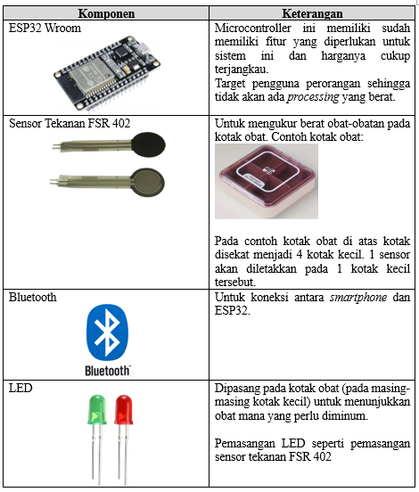

# System Architecture Kotak Obat Pintar
## Background
Banyak pasien kesulitan mengingat untuk minum obat yang diresepkan kepadanya baik karena banyak distraksi / pekerjaan atau karena memiliki ingatan yang buruk.

Terutama untuk pasien yang memiliki penyakit kronis dan memerlukan berbagai macam obat dengan dosis, jumlah tablet, dan waktu minum obat yang berbeda akan merasa kewalahan dalam  mengelola rutinitas dan minum obatnya.

Dokter juga menjadi kesulitan meyakini apakah obat yang diresepkannya tidak efektif ataukah ketidakefektivitasan disebabkan karena pasien tidak teratur meminum obatnya. Terdapat kemungkinan juga pasien tidak memberitahukan yang sebenarnya (tidak rutin minum obat) karena segan dan lain hal.

## Problem Statement
*	Pasien kesulitan mengelola rutinitas minum obat
*	Pasien lupa apakah sudah minum obat atau belum
*	Pasien yang diresepkan banyak jenis obat kesulitan mengingat setiap dosis, jumlah tablet, dan waktu minum obat.
*	Dokter kesulitan memberikan nasehat perawatan lanjutan 
*	Dokter tidak dapat mengetahui dengan pasti efektivitas obat yang diresepkan.

## Proposed Product
Kotak obat pintar yang memanfaatkan IoT dan terhubung dengan aplikasi pada smartphone untuk manajemen obat pasien. Sistem ini akan mengingatkan pasien untuk meminum obatnya sesuai dengan jadwal yang telah diatur. Sistem ini akan memanfaatkan sensor berat pada kotak obat untuk mencatat secara otomatis bahwa obat telah diminum, hal ini juga untuk menghindari pasien lupa meng-update pada aplikasi.

Sistem kotak pintar ini juga dapat diatur untuk mengirimkan data ke aplikasi / sistem rumah sakit sehingga dokter memiliki informasi yang lebih akurat terkait medication adherence pasien dan dapat menarik kesimpulan terkait efektivitasnya dalam mengobati gejala pasien. 

Selain itu, terdapat peluang untuk memanfaatkan data dari sistem tersebut untuk melakukan analisa seperti:
*	Keefektifan obat tertentu dalam mengobati gejala / penyakit jika obat rutin di minum
*	Berapa kali obat harus diminum sampai gejala membaik?
*	Dll.
Namun tentunya agar data dapat dimanfaatkan untuk keperluan analisa diperlukan consent dari pasien terlebih dahulu. Pengelolaan data juga harus memperhatikan kepatuhannya terhadap peraturan regulator seperti UU Perlindungan Data Pribadi (UU PDP)

## Expected Impact
*	Pasien lebih mudah dalam mengelola rutinitas minum obatnya
*	Dokter dapat lebih akurat memberikan nasehat perawatan lanjutan
*	Potensi pemanfaatan data untuk dianalisa:
  * sehingga rumah sakit / dokter dapat mengetahui efektivitas setiap obat dengan lebih baik
  * rumah sakit / dokter memiliki data mana obat yang paling efektif untuk mengobati gejala / penyakit tertentu.

## Technology Component 

