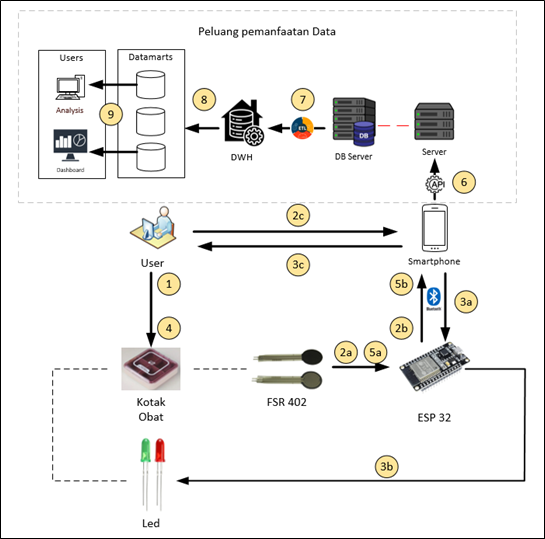
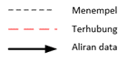

# System Architecture Kotak Obat Pintar
## Background
Banyak pasien kesulitan mengingat untuk minum obat yang diresepkan kepadanya baik karena banyak distraksi / pekerjaan atau karena memiliki ingatan yang buruk.

Terutama untuk pasien yang memiliki penyakit kronis dan memerlukan berbagai macam obat dengan dosis, jumlah tablet, dan waktu minum obat yang berbeda akan merasa kewalahan dalam  mengelola rutinitas dan minum obatnya.

Dokter juga menjadi kesulitan meyakini apakah obat yang diresepkannya tidak efektif ataukah ketidakefektivitasan disebabkan karena pasien tidak teratur meminum obatnya. Terdapat kemungkinan juga pasien tidak memberitahukan yang sebenarnya (tidak rutin minum obat) karena segan dan lain hal.

## Problem Statement
*	Pasien kesulitan mengelola rutinitas minum obat
*	Pasien lupa apakah sudah minum obat atau belum
*	Pasien yang diresepkan banyak jenis obat kesulitan mengingat setiap dosis, jumlah tablet, dan waktu minum obat.
*	Dokter kesulitan memberikan nasehat perawatan lanjutan 
*	Dokter tidak dapat mengetahui dengan pasti efektivitas obat yang diresepkan.

## Proposed Product
Kotak obat pintar yang memanfaatkan IoT dan terhubung dengan aplikasi pada smartphone untuk manajemen obat pasien. Sistem ini akan mengingatkan pasien untuk meminum obatnya sesuai dengan jadwal yang telah diatur. Sistem ini akan memanfaatkan sensor berat pada kotak obat untuk mencatat secara otomatis bahwa obat telah diminum, hal ini juga untuk menghindari pasien lupa meng-update pada aplikasi.

Sistem kotak pintar ini juga dapat diatur untuk mengirimkan data ke aplikasi / sistem rumah sakit sehingga dokter memiliki informasi yang lebih akurat terkait medication adherence pasien dan dapat menarik kesimpulan terkait efektivitasnya dalam mengobati gejala pasien. 

Selain itu, terdapat peluang untuk memanfaatkan data dari sistem tersebut untuk melakukan analisa seperti:
*	Keefektifan obat tertentu dalam mengobati gejala / penyakit jika obat rutin di minum
*	Berapa kali obat harus diminum sampai gejala membaik?
*	Dll. 
Namun tentunya agar data dapat dimanfaatkan untuk keperluan analisa diperlukan consent dari pasien terlebih dahulu. Pengelolaan data juga harus memperhatikan kepatuhannya terhadap peraturan regulator seperti UU Perlindungan Data Pribadi (UU PDP)

## Expected Impact
-	Pasien lebih mudah dalam mengelola rutinitas minum obatnya
-	Dokter dapat lebih akurat memberikan nasehat perawatan lanjutan
-	Potensi pemanfaatan data untuk dianalisa:
     - sehingga rumah sakit / dokter dapat mengetahui efektivitas setiap obat dengan lebih baik
     - rumah sakit / dokter memiliki data mana obat yang paling efektif untuk mengobati gejala / penyakit tertentu.

## Technology Component 

## System Architecture
  
**Note:** 
 

**Penjelasan gambar:** 
1.	Pasien memasukkan obat dari kotak obat 
2a.	Sensor FR 402 mengirimkan data ke ESP 32 
2b.	ESP 32 mengirimkan data ke smartphone via bluetooth untuk ditampilkan 
2c.	Pasien memasukkan informasi seperti nama obat, dosis, jadwal dan mengatur alarm 
3a.	Smartphone mengirimkan data ke ESP 32 
3b.	ESP 32 mengirimkan command ke LED untuk menyala 
3c.	Smartphone memberi alert / peringatan pada pasien 
4.	Pasien mengambil obat 
5a.	Sensor FR 402 mengirimkan data ke ESP 32 
5b.	Sensor mengirimkan data ke smartphone untuk mengupdate informasi 
6.	Smartphone mengirimkan data ke server rumah sakit dan disimpan di DB Server via REST API 
7.	Proses ETL (Extract, Transform and Load) ke DWH (Data Warehouse) 
8.	Data diturunkan ke datamarts 
9.	Data diambil users untuk dimanfaatkan, misalnya untuk analysis atau pembuatan dashboards 

**Penjelasan tambahan:** 
Tahap 1 – 2c 
•	Pada tahap 1 – 2c, pasien melakukan ‘pendaftaran obat’ pada aplikasi di smartphone pasien.  
•	Pasien akan menambahkan obat baru pada aplikasi kemudian memasukkan 1 tablet untuk dibaca beratnya oleh sensor tekanan FR 402. 
•	Setelah sensor memperoleh berat per 1 tablet, data berat tersebut akan dikirimkan ke esp 32 kemudian diteruskan ke smartphone. 
•	Pasien kemudian memasukkan seluruh obatnya dan proses 2a s/d 2c akan berulang lagi, namun dengan tambahan proses di aplikasi yang akan mengalkulasi jumlah tablet yang dimasukkan berdasarkan berat satuannya. 
•	Pasien kemudian memasukkan informasi lainnya seperti nama obat, dosis, dan jadwal untuk mengatur alert. 
Tahap 6 
•	Data yang dikirimkan berupa nama obat, dosis obat, frekuensi minum obat, jumlah obat yang diminum, dan waktu ketika pasien meminum obat.  

